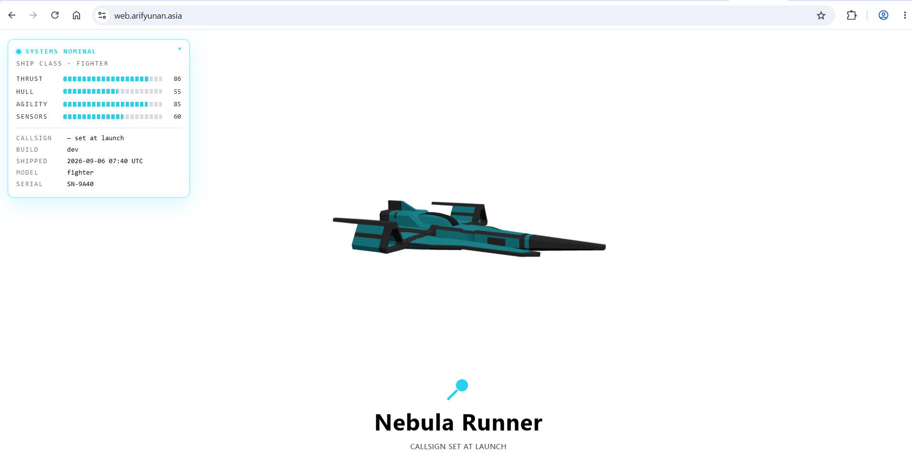
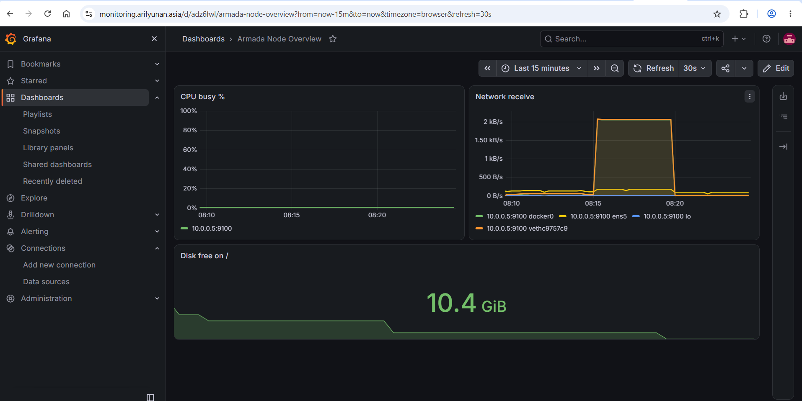

# DevOps Bootcamp Project

End-to-end DevOps bootcamp project that provisions AWS infrastructure with Terraform, configures services with Ansible, builds the **Ship** web application into a Docker image, publishes that image to Amazon ECR, and deploys it to an EC2 web server. A separate monitoring stack (Prometheus + Grafana) runs on its own server and is exposed through a Cloudflare Tunnel. Repository documentation is automatically synchronized to a GitHub Pages site using GitHub Actions.

## URLs

| Service | URL |
|---|---|
| Application | https://web.arifyunan.asia |
| Documentation site | [https://documentation.arifyunan.asia/](https://arifoyunano.github.io/devops-bootcamp-project) |
| Source repository | [ArifoYunano/devops-bootcamp-project](https://github.com/ArifoYunano/devops-bootcamp-project) |
| Monitoring (Grafana) | https://monitoring.arifyunan.asia |
| Monitoring (Prometheus) | https://prometheus.arifyunan.asia |

## Repository Layout

The repository is organized as a monorepo. It contains the web application, automation, infrastructure-as-code, and documentation tooling in one place.

| Path | Purpose |
|---|---|
| `app/` | Ship application source code, Dockerfile, and `.dockerignore` |
| `ansible/` | Inventory, Ansible configuration, and server deployment playbooks |
| `terraform/` | AWS infrastructure-as-code files |
| `scripts/sync-docs.mjs` | Synchronizes `README.md` and the root `index.html` documentation site |
| `package.json` | Root Node.js tooling for the documentation sync command |
| `.github/workflows/commit-pipeline.yml` | Synchronizes documentation after documentation changes are pushed |
| `.github/workflows/static.yml` | Deploys the root `index.html` to GitHub Pages |
| `index.html` | GitHub Pages entry point generated from this README |

```
.
├── .github/
│   └── workflows/
│       ├── commit-pipeline.yml
│       └── static.yml
├── ansible/
├── app/
│   ├── Dockerfile
│   ├── .dockerignore
│   ├── package.json
│   ├── public/
│   ├── scripts/
│   └── src/
├── terraform/
├── .gitignore
├── index.html
├── package.json
└── README.md
```


## Architecture

The deployment pipeline moves the application through source control, containerization, a private container registry, configuration management, and public DNS. Monitoring runs as a separate path via Cloudflare Tunnel rather than public inbound ports.

```
GitHub repository
        |
        v
Ansible controller (10.0.0.135)
  - builds Docker image
  - pushes image to Amazon ECR
        |
        v
Amazon ECR private repository
  296766961942.dkr.ecr.ap-southeast-1.amazonaws.com/
  devops-bootcamp/final-project-arifyunan:v1
        |
        v
Web EC2 server (10.0.0.5)
  - Ansible pulls image from ECR
  - Docker runs Nginx container on port 80
        |
        v
Cloudflare DNS (proxied A record)
  web.arifyunan.asia
        |
        v
Public Ship application
```

```
Monitoring server (10.0.0.136)
  - Prometheus + Grafana via Docker Compose
  - Node Exporter target: web server (10.0.0.5), via exporters group
        |
        v
cloudflared (Cloudflare Tunnel)
        |
        v
monitoring.arifyunan.asia (Grafana)
prometheus.arifyunan.asia (Prometheus)
```

### Infrastructure nodes

| Node | Private IP | Role |
|---|---|---|
| Ansible controller | 10.0.0.135 | Builds and publishes the application image; runs Ansible playbooks |
| Web server | 10.0.0.5 | Pulls the ECR image and serves the application container on port 80; also a Node Exporter target |
| Monitoring server | 10.0.0.136 | Hosts Prometheus, Grafana, and the Cloudflare Tunnel |

All infrastructure is deployed in AWS region **ap-southeast-1**, inside a single VPC (`10.0.0.0/24`) with a public subnet (`10.0.0.0/25`) and a private subnet (`10.0.0.128/25`) connected via a single NAT gateway.

## Quickstart

Clone the repository:

```bash
git clone https://github.com/ArifoYunano/devops-bootcamp-project.git
cd devops-bootcamp-project
```

Provision or update AWS infrastructure using Terraform:

```bash
cd terraform
terraform init
terraform plan
terraform apply
```

Run Ansible from the controller to deploy the web image:

```bash
cd ../ansible
ansible-playbook playbook-web.yaml
```

Verify that the web server responds from inside the VPC:

```bash
curl -I http://10.0.0.5/
```

Expected result:

```
HTTP/1.1 200 OK
```

## Terraform

Terraform defines the AWS infrastructure used by the project.

- **Backend:** S3, with native state locking (`use_lockfile = true`) 
- **Modules:** `terraform-aws-modules/vpc/aws` and `terraform-aws-modules/ec2-instance/aws`
- **Key pair:** existing `arifyunan-keypair`
- **Provider:** `hashicorp/aws ~> 6.58`, Terraform `>= 1.15`

### Typical Terraform responsibilities

- Create the VPC, subnets, route tables, NAT connectivity, and security groups
- Create EC2 instances for the controller, web server, and monitoring stack
- Associate the shared `EC2-SSM-Role` IAM role (SSM access + ECR push/pull via `AmazonEC2ContainerRegistryPowerUser`) across all three instances
- Configure inbound rules required by the deployment
- Generate `inventory.ini` from instance IPs via a `templatefile()` resource

### Security requirements

| Protocol | Port | Source | Reason |
|---|---|---|---|
| TCP | 80 | 0.0.0.0/0 | Public HTTP access to the Nginx container (web server) |
| TCP | 22 | VPC only | Administrative SSH |
| TCP | 9100 | Monitoring server only | Node Exporter scraping |

Prometheus (9090) and Grafana (3000) are **not** exposed via public security group rules — they're reached exclusively through the Cloudflare Tunnel running on the monitoring server, so no inbound ports need to be opened for them at all.

Do not commit Terraform state, plans, `.terraform/`, private keys, or secret variable files. They are excluded through `.gitignore`.

## Ansible

Ansible configures the servers after infrastructure is available.

### Inventory groups

```
[web]
10.0.0.5

[monitoring]
10.0.0.136

[exporters]
10.0.0.5
```

A host can belong to more than one group. The web server belongs to both `web` and `exporters` because it runs the application and is also a monitoring target.

### Web deployment

`ansible/playbook-web.yaml` deploys the web application. Its main tasks are:

1. Ensure Docker is running and enabled
2. Install AWS CLI v2 if missing (via the official installer, not the distro package — the Ubuntu AMI used here doesn't have the `universe` repo component enabled, so `apt install awscli` isn't resolvable)
3. Authenticate Docker to private Amazon ECR
4. Stop the older Docker Compose Nginx stack if present
5. Remove the previous web container
6. Pull the selected ECR image
7. Run the new web container with `80:80` port publishing
8. Verify the container serves HTTP 200 locally on the web server

Run the deployment:

```bash
cd ansible
ansible-playbook playbook-web.yaml
```

Check the running container:

```bash
ansible web -m ansible.builtin.command -a "docker ps" -b
```

Expected port mapping:

```
0.0.0.0:80->80/tcp
```

### Monitoring stack

`ansible/playbook-stack.yaml` deploys Prometheus and Grafana to the monitoring server via Docker Compose (using the `geerlingguy.docker` Galaxy role) and copies the Cloudflare Tunnel token needed by `cloudflared`. `ansible/playbook-exporter.yaml` installs Node Exporter on the `exporters` group (currently just the web server) using the `prometheus.prometheus` Galaxy collection.

## Application

The application is **Ship**, a Vite-based web application using Three.js. The upstream source lives at [Infratify/ship](https://github.com/Infratify/ship) and is vendored into this repo under `app/`.

### Application commands

Run these commands from the application directory:

```bash
cd app
npm ci
npm run dev
npm test
npm run build
npm run preview
```

| Command | Purpose |
|---|---|
| `npm ci` | Install exact dependency versions from `package-lock.json` |
| `npm run dev` | Start the Vite development server |
| `npm test` | Run the application preflight check (validates `ship.config.json`) |
| `npm run build` | Generate production files in `dist/` |
| `npm run preview` | Serve the built application locally for validation |

### Docker image

The application uses a multi-stage Docker build.

- The Node.js build stage installs dependencies using `npm ci`
- Vite generates optimized static files with `npm run build`
- The Nginx runtime stage copies only `dist/` and serves it on port 80

```dockerfile
FROM node:20-alpine AS build

WORKDIR /app

COPY package.json package-lock.json ./
RUN npm ci

COPY . .
RUN npm run build

FROM nginx:alpine

COPY --from=build /app/dist /usr/share/nginx/html

EXPOSE 80

CMD ["nginx", "-g", "daemon off;"]
```

Build and push the image directly from the Ansible controller (it already carries an IAM role with ECR permissions, so no local AWS credentials are needed):

```bash
cd ~/app  # or wherever the app/ source is checked out on the controller

aws ecr get-login-password --region ap-southeast-1 \
  | sudo docker login --username AWS --password-stdin 296766961942.dkr.ecr.ap-southeast-1.amazonaws.com

sudo docker build -t 296766961942.dkr.ecr.ap-southeast-1.amazonaws.com/devops-bootcamp/final-project-arifyunan:v1 .

sudo docker push 296766961942.dkr.ecr.ap-southeast-1.amazonaws.com/devops-bootcamp/final-project-arifyunan:v1
```

## Amazon ECR

The container image is stored in private Amazon ECR.

- **Registry:** `296766961942.dkr.ecr.ap-southeast-1.amazonaws.com`
- **Repository:** `devops-bootcamp/final-project-arifyunan`
- **Tag:** `v1`
- **Full image URI:** `296766961942.dkr.ecr.ap-southeast-1.amazonaws.com/devops-bootcamp/final-project-arifyunan:v1`

### IAM permissions

A single IAM role, `EC2-SSM-Role`, is shared across all three instances (originally created for SSM access). It has `AmazonEC2ContainerRegistryPowerUser` attached, which covers both the controller's push permissions and the web server's pull permissions:

> Sharing one role across all three instances is a deliberate simplification for a personal project — it means the monitoring server also technically has ECR access it doesn't need, in exchange for not maintaining separate roles.

## Cloudflare DNS

The web application runs on the EC2 web server but is exposed using Cloudflare DNS.

An A record in the `arifyunan.asia` Cloudflare zone:

| Field | Value |
|---|---|
| Type | A |
| Name | web |
| Content | Public IPv4 address (Elastic IP) of the web EC2 instance |
| Proxy status | Proxied (orange cloud) |
| TTL | Auto |

Do not use the private IP `10.0.0.5` in Cloudflare — it must point to the instance's public Elastic IP.

**SSL/TLS mode:** set to **Flexible**, since the origin Nginx container only serves plain HTTP on port 80 (no certificate configured on the instance itself). Flexible lets Cloudflare terminate HTTPS at the edge for visitors while still connecting to the origin over HTTP.

Verify the published application:

```bash
curl -I https://web.arifyunan.asia
```

## Monitoring

The monitoring server (10.0.0.136) runs Prometheus and Grafana via Docker Compose. Node Exporter targets only the web server, through the `exporters` Ansible group.

Unlike the web application, monitoring is **not** exposed via a Cloudflare DNS A record pointing at a public IP — instead, `cloudflared` (Cloudflare Tunnel) runs alongside the stack and creates outbound-only connections to Cloudflare's edge, so no inbound ports need to be opened on the monitoring server's security group at all.

- Grafana: https://monitoring.arifyunan.asia
- Prometheus: https://prometheus.arifyunan.asia

## CI/CD

Two GitHub Actions workflows live under `.github/workflows/`.

| Workflow | Purpose |
|---|---|
| `commit-pipeline.yml` | Synchronizes `README.md` and root `index.html`, auto-committing generated documentation changes as `github-actions[bot]` |
| `static.yml` | Deploys the root static site to GitHub Pages |

### Documentation sync

`scripts/sync-docs.mjs` keeps `README.md` and `index.html` aligned. `commit-pipeline.yml` runs it (`npm ci` then `npm run sync:docs -- --write`) whenever `README.md`, `scripts/sync-docs.mjs`, `package.json`, or `package-lock.json` change on `main`, and commits the regenerated `index.html` if it differs. A guard (`if: github.actor != 'github-actions[bot]'`) prevents the bot's own commits from re-triggering the sync job.

Run the sync locally from the repository root:

```bash
npm install
npm run sync:docs           # dry run
npm run sync:docs -- --write # writes the generated result to disk
```

### GitHub Pages

GitHub Pages is configured with:

```
Repository Settings -> Pages -> Build and deployment -> Source: GitHub Actions
```

`static.yml` triggers on pushes that touch `index.html` (including the bot's own commits from `commit-pipeline.yml`) or via manual `workflow_dispatch`, builds the Pages artifact with `actions/configure-pages` + `actions/upload-pages-artifact`, and deploys with `actions/deploy-pages`. The site publishes at:

https://arifoyunano.github.io/devops-bootcamp-project/

### CI/CD validation

To test the complete documentation pipeline:

```bash
nano README.md
npm run sync:docs -- --write

git add README.md index.html
git commit -m "docs: update deployment documentation"
git push origin main
```

After the push:

1. `Docs Sync` (`commit-pipeline.yml`) runs and synchronizes the documentation files
2. If `index.html` changed, `github-actions[bot]` creates a commit containing the generated changes
3. `Deploy static site to GitHub Pages` (`static.yml`) picks up that change and publishes the updated `index.html`
4. The GitHub Pages documentation site reflects the latest README content


## Security Notes

The following must never be committed to GitHub:

- AWS credentials and access keys
- GitHub personal access tokens
- SSH private keys, `.pem`, and `.key` files
- `.env` files containing secrets
- Terraform state files and plans
- Ansible vault passwords or secret variable files

The root `.gitignore` excludes common sensitive and generated files, including `node_modules/`, `dist/`, `.terraform/`, `*.tfstate`, `*.tfvars`, `.env*`, keys, and credentials.

   

   Web

   

   Grafana

## Project Status

- [x] Application built with Vite
- [x] Multi-stage Docker image built with Node.js and Nginx
- [x] Image pushed to private Amazon ECR
- [x] Ansible pulls the ECR image on the web server
- [x] Docker container serves the application on port 80
- [x] HTTP verification returned 200 OK
- [x] Cloudflare record exposes web.arifyunan.asia (with Flexible SSL)
- [x] Cloudflare Tunnel exposes the monitoring stack (Grafana + Prometheus)
- [x] Documentation sync workflow is active
- [x] GitHub Pages deployment workflow is active

